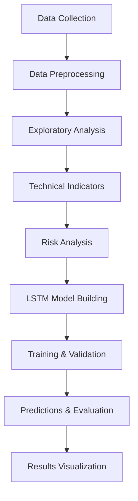

# Stock Price Analysis & Prediction using LSTM
> **A comprehensive educational project demonstrating stock market analysis and price prediction using LSTM neural networks. Perfect for learning financial data science!**


##  Project Overview

This repository contains a comprehensive pipeline for stock market price analysis, which builds an LSTM-based predictive model to forecast future stock prices. It uses real historical data from Yahoo Finance and applies data preprocessing, feature engineering, technical analysis, and deep learning for accurate predictions.


### Key Objectives

* Data Collection: Download real stock data from Yahoo Finance

* Exploratory Analysis: Visualize price movements, volume, and trends

* Technical Analysis: Compute moving averages and trading indicators

* Risk Analysis: Measure volatility and risk using statistical methods

* Machine Learning: Build an LSTM neural network for price prediction

* Evaluation: Test and compare prediction accuracy with real data

### Features

1. Fetch real-time historical stock data
2. Perform EDA with charts and insights
3. Calculate technical indicators (Moving Averages, Volatility)
4. Model future stock prices using LSTM
5. Evaluate accuracy with RMSE and visualization


### Option 1: Google Colab (Recommended)
[](https://colab.research.google.com/github/SharonneKemboi/STOCK-PRICE-PREDICTION/blob/main/stock_analysis_explained.ipynb)

1. Click the "Open in Colab" button above
2. Run all cells sequentially
3. Customize stock tickers in the configuration section

### Option 2: Local Setup
```bash
git clone https://github.com/SharonneKemboi/STOCK-PRICE-PREDICTION.git
cd STOCK-PRICE-PREDICTION
pip install -r requirements.txt
jupyter notebook stock_analysis_explained.ipynb
```

##  Dependencies

```txt
yfinance>=0.2.12
pandas>=1.5.0
numpy>=1.21.0
matplotlib>=3.5.0
seaborn>=0.12.0
scikit-learn>=1.1.0
tensorflow>=2.8.0
```

## 🎛️ Configuration

Easily customize your analysis by modifying these parameters:

```python
# Stocks to analyze
TICKERS = ['AAPL', 'MSFT', 'GOOG', 'TSLA', 'AMZN']

# Date range for analysis
START = '2020-01-01'
END = datetime.today().strftime('%Y-%m-%d')

# Prediction settings
TARGET = 'AAPL'      # Stock to predict
TIME_STEP = 60       # Days of history to use
```

## Features & Analysis

### 1.  Stock Price Analysis
- Historical price visualization with moving averages
- Trend analysis and pattern identification
- Multi-timeframe technical indicators

### 2.  Trading Volume Analysis
- Volume patterns and anomaly detection
- Normalized volume comparison across stocks
- Volume-price relationship analysis

### 3.  Risk Assessment
- **Volatility Analysis**: Annualized standard deviation
- **Value at Risk (VaR)**: Maximum expected loss at 95% confidence
- **Conditional VaR**: Expected loss during worst-case scenarios
- **Correlation Matrix**: Inter-stock relationship analysis

### 4.  LSTM Prediction Model
- Sequential neural network architecture
- 60-day lookback window for pattern recognition
- Dropout layers for overfitting prevention
- Model validation and performance metrics

### 5.  Performance Evaluation
- Multiple accuracy metrics (MAE, RMSE, MAPE)
- Directional accuracy assessment
- Comparison with naive baseline models
- Error distribution analysis

##  Sample Results

### Model Performance (AAPL Example)
| Metric | Value | Interpretation |
|--------|-------|----------------|
| MAE | $2.45 | Average prediction error |
| RMSE | $3.21 | Root mean square error |
| MAPE | 1.8% | Mean absolute percentage error |
| Directional Accuracy | 67.3% | Correct up/down predictions |

### Risk Analysis Summary
```
Stock Volatility Analysis:
• AAPL: 28.5% annual volatility (Medium Risk)
• MSFT: 24.1% annual volatility (Low-Medium Risk)
• TSLA: 45.2% annual volatility (High Risk)
```

##  Workflow




##  Visualization Gallery

The notebook generates various professional visualizations:

- ** Price Charts**: Multi-stock comparison with moving averages
- ** Volume Analysis**: Trading activity patterns over time  
- ** Correlation Heatmaps**: Stock relationship matrices
- ** Risk Distributions**: Return histograms and density plots
- ** Prediction Charts**: Actual vs predicted price comparisons
- ** Performance Metrics**: Model accuracy visualizations

##  Key Learning Outcomes

After completing this project, I was able to learn and understand:

### Financial Analysis
- How to download and process real market data
- Technical analysis concepts and implementation
- Risk measurement and portfolio theory
- Market correlation and diversification principles

### Machine Learning
- Time series data preparation and sequence creation
- LSTM architecture design and implementation
- Model training, validation, and hyperparameter tuning
- Evaluation metrics for regression problems

### Data Science
- End-to-end ML project workflow
- Data visualization best practices
- Statistical analysis of financial data
- Python ecosystem for quantitative finance

##  Disclaimers & Limitations

###  Investment Disclaimer
**This project is for educational purposes only and should not be used for actual trading decisions.**
- Stock markets are inherently unpredictable
- Past performance does not guarantee future results
- Always consult qualified financial advisors
- Never invest money you cannot afford to lose

###  Technical Limitations
- **Simplified Model**: Real trading algorithms are far more complex
- **Limited Features**: Only uses price/volume data (missing news, fundamentals)
- **Market Regime**: Model may not adapt to changing market conditions
- **Survivorship Bias**: Analysis only includes currently listed stocks

##  Contributing

Contributions are welcome! Please feel free to submit a Pull Request.

### How to Contribute
1. Fork the repository
2. Create a feature branch (`git checkout -b feature/AmazingFeature`)
3. Commit your changes (`git commit -m 'Add some AmazingFeature'`)
4. Push to the branch (`git push origin feature/AmazingFeature`)
5. Open a Pull Request

### Ideas for Contributions
- ** New Indicators**: RSI, MACD, Bollinger Bands
- ** Model Improvements**: Transformer, GRU, Ensemble methods
- ** Additional Metrics**: Sharpe ratio, Maximum Drawdown
- ** Visualizations**: Interactive plots, Plotly dashboards
- ** Documentation**: More examples, tutorials, explanations

##  Support

- ** Bug Reports**: Use [GitHub Issues](https://github.com/SharonneKemboi/STOCK-PRICE-PREDICTION/issues)
- ** Feature Requests**: Open a [GitHub Discussion](https://github.com/SharonneKemboi/STOCK-PRICE-PREDICTION/discussions)
- ** Questions**: Check existing issues or start a new discussion


## 📄 License

This project is licensed under the MIT License - see the [LICENSE](LICENSE) file for details.

## 🙏 Acknowledgments

- **Arch Technologies** for providing the opportunity to develop this project
- **Yahoo Finance** for providing free financial data API
- **TensorFlow** team for an excellent deep learning framework
- **Pandas** community for powerful data manipulation tools
- **Matplotlib/Seaborn** for beautiful visualization capabilities
- **Open Source Community** for making financial data science accessible

---

<div align="center">

** If this project helped you, please give it a star! ⭐**


*Remember: This is for education, not financial advice!*

</div>
